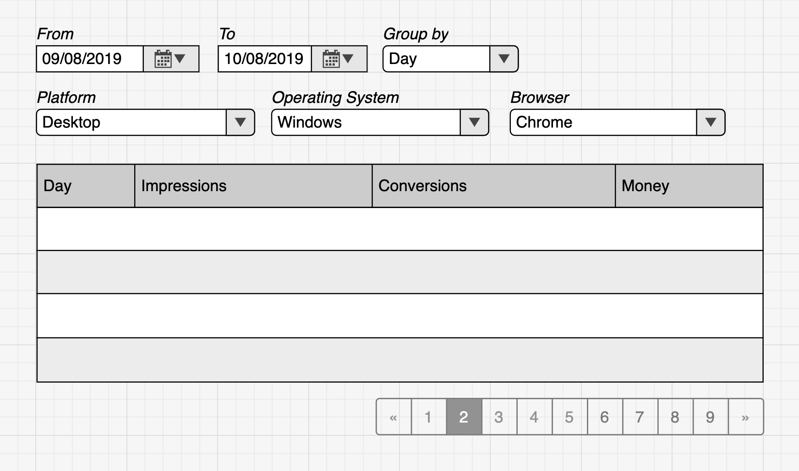

## Тестовое задание на должность Junior Frontend разработчика в AdGo

### Задача
Наша компания занимается рекламой и мы собираем огромное много статистических данных о показах, кликах и количестве денег которое заработали со всего этого дела. Одним из основных инструментов нашей системы является интерфейс для просмотра и анализа подбного рода данных. Мы называем его "статистика" и предлагаем реализовать Вам упрощенную версию данного инструмента.

Статистику можно представить как набор событий о показах рекламы. Каждый показ происходит в определенном браузере, в определенной операционной системе... Также показ может привести к клику пользователя по рекламному объявлению и соотвественно заработку некоторой суммы денег.

Реализуйте вывод подобных статистических данных в таблицу. Добавьте возможность сгруппировать данные, применить фильтры, а также просмотр в режиме постраничной навигации.


<p align="center"><i>Схематичное представление задания.</i></p>


В данном репозитории лежит api-сервер, который умеет общаться по `HTTP` и отдавать статистику о которой писали выше. Смотри раздел с API для подробного описания работы api-сервера.

Для запуска веб сервера выполните команду `npm start`

О задании более детально:
- Убедитесь, что в вашей системе установлен node.js последней версии;
- Прочитайте и уточните все вопросы по задаче;
- Реализуйте следующий функционал:
    - Таблица с отображением данных;
    - Выбор группировки данных;
    - Фильтр с выбором:
        - Периода за который происходит выбор статистики;
        - Фильтры по платформе, браузеровам и операционным системам, о которых будет отображена информация.
    - Постраничную навигацию, например по 25 строк на странице.

### Инструменты для разработки и прочие технические моменты
Мы надеемся что вы зафоркаете и склонируете данный репозиторий, а затем реализуете свое решение в директории **app**. А затем создадите **pull request** в наш репозиторий. Мы оценим как круто вы владеет системой контроля версий GIT.

Фронтэнд должен быть написан на **React** и пожалуйста, приложите инструкцию как нам запустить ваше решение в пару простых команд.

Мы не хотим накладывать на вас ограничения, вы можете использовать кроме **React** любые другие библиотеки на свой выбор, но нам в свою очередь хочется увидеть **ваш код** и **ваши решения**.

Про **css** и какие-то билиотеки готовых компонентов, например **Bootstrap**. Вы можете оформить проект как угодно, даже если это будет чистый **html** с минимальным количеством **css**, нам хватит. Если вы не можете не делать супер красивые интерфейсы и любите какой-то набор компонентов, можете воспользоваться им).

### API
`GET /api/v1/platforms` - список платформ

Пример ответа:
```
[  
    {  
        "label": "Desktop",
        "value": 1
    },
    {  
        "label": "Mobile",
        "value": 2
    }
]
```

`GET /api/v1/browsers` - список браузеров

Пример ответа:
```
[  
    {  
        "label": "Chrome",
        "value": 1,
        "platform": 1
    },
    {  
        "label": "Firefox",
        "value": 2,
        "platform": 1
    },
    {
        "..."
    }
]
```

`GET /api/v1/operating-systems` - список операционных систем

Пример ответа:
```
[  
     {  
        "label": "Windows",
        "value": 1,
        "platform": 1
    },
    {  
        "label": "Mac OS",
        "value": 2,
        "platform": 1
    },
    {
        "..."
    }
]
```

`GET /api/v1/groups` - список группировок

Пример ответа:
```
[  
    {  
        "label": "Day",
        "value": "day"
    },
    {  
        "label": "Platform",
        "value": "platform"
    },
    {
        "..."
    }
]
```

`GET /api/v1/statistics?searchParams` - та самая статистика

Ответ выглядит вот так:
```
{
	"count": количество всех записей на сервере по вашему запросу
	"rows": данные, с учетом пагинации
	"total": просуммированные показатели, вычисляются на основе всех записей, а не только тех что в поле rows
}
```

Обязательные `searchParams`
- `groupBy` - по какому полю группировать, в качестве значения нужно передавать поле `value` из списка группировок
- `from` - дата с которой нужно извлекать события, строка, в формате `YYYY-MM-DD`
- `to` - дата по которую включительно нужно извлекать события, строка, в формате `YYYY-MM-DD`

Необязательные `searchParams`
- `limit` - сколько записей отдать, число, по умолчанию 25
- `offset` - сдвиг с какой страницы взять, по умолчанию 0, например `offset=0&limit=25` возвращают первые 25 записей, а `offset=1&limit=25` вернет следующие 25 строк
- `platform` - вы получите данные только по переданной платформе, в качестве значения нужно передавать поле `value` из списка платформ
- `browsers[]` - вы получите данные только по переданным браузерам, в качестве значения нужно передавать поле `value` из списка брузеров,  можно передать несколько
- `operatingSystems[]` - вы получите данные только по переданным операционным системам, в качестве значения нужно передавать поле `value` из списка операционных систем, можно передать несколько


Несколько примеров

Получаем статистику за первые 7 дней июля, сгруппированную по дням

`/api/v1/statistics?groupBy=day&from=2019-07-01&to=2019-07-07`

Ответ:
```
{  
    "count": 7,
    "rows":[  
        {  
            "day":"2019-07-01",
            "impressions":23,
            "clicks":4,
            "money":0.15445
        },
        {  
            "day":"2019-07-02",
            "impressions":11,
            "clicks":1,
            "money":0.06262
        },
        {  
            "day":"2019-07-03",
            "impressions":17,
            "clicks":1,
            "money":0.01448
        },
        {  
            "day":"2019-07-04",
            "impressions":13,
            "clicks":2,
            "money":0.17215
        },
        {  
            "day":"2019-07-05",
            "impressions":24,
            "clicks":8,
            "money":0.41402999999999995
        },
        {  
            "day":"2019-07-06",
            "impressions":21,
            "clicks":4,
            "money":0.33422999999999997
        },
        {  
            "day":"2019-07-07",
            "impressions":23,
            "clicks":4,
            "money":0.04693
        }
    ],
    "total":{  
        "impressions":132,
        "clicks":24,
        "money":1.1988899999999998
    }
}
```

Вот так можем посмотреть что у нас происходило в июне и на разных платформах

`/api/v1/statistics?groupBy=platform&from=2019-06-01&to=2019-06-30`

Ответ:
```
{  
    "count": 2,
    "rows":[  
        {  
            "platform":"Mobile",
            "impressions":473,
            "clicks":97,
            "money":4.42389
        },
        {  
            "platform":"Desktop",
            "impressions":133,
            "clicks":17,
            "money":0.97717
        }
    ],
    "total":{  
        "impressions":606,
        "clicks":114,
        "money":5.40106
    }
}
```

### The end

Баг фиксы и правки приветствуются. Все вопросы можно задать в телеграмм @sse1595

Удачи!
